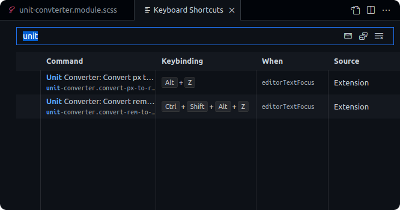
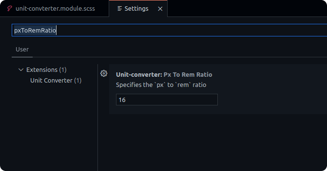

# Unit Converter for CSS values

This extensions allows conversions between `px` and `rem` values.

## Features

Converts values in the selection to the respective value.

Adds default key bindings for the extension commands. These can be modified from the Keyboard Shortcuts editor as required.

- `Alt+Z` to convert `px` to `rem`
- `Ctrl+Shift+Alt+Z` to convert `rem` to `px`

Enjoy an easier life is easier with keyboard shortcuts

The extension allows you to configure the px to rem ratio.  
By default the value is to `16` (ie: `1rem` = `16px` by default). The value can be updated to `14`, `18`, etc as required.

## Release Notes

### 1.3.0

Allows updating `px` to `rem` ratio, which defaults to `16` (`1rem` = `16px` by default)

### 1.2.0

Adds support to convert values under the cursor without having to select

### 1.1.1

Fixed the issue with comma separator showing up of for larger values

### 1.1.0

Default keyboard keybindings added

- `Alt+Z` to convert `px` to `rem`
- `Ctrl+Shift+Alt+Z` to convert `rem` to `px`

### 1.0.0

Initial release.

- Allows value conversion on selections from `px` to `rem`
- Allows value conversion on selections from `rem` to `px`
- Provides a prompt for input if nothing is selected

🙌
