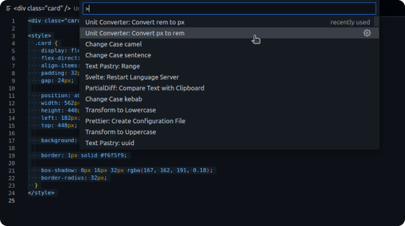

# Unit Converter for CSS values

This extensions allows conversions between `px` and `rem` values.

## Features

Converts values in the selection to the respective value.

## Release Notes

### 1.0.0

Initial release.

- Allows value conversion on selections from `px` to `rem`
- Allows value conversion on selections from `rem` to `px`
- Provides a prompt for input if nothing is selected

🙌
